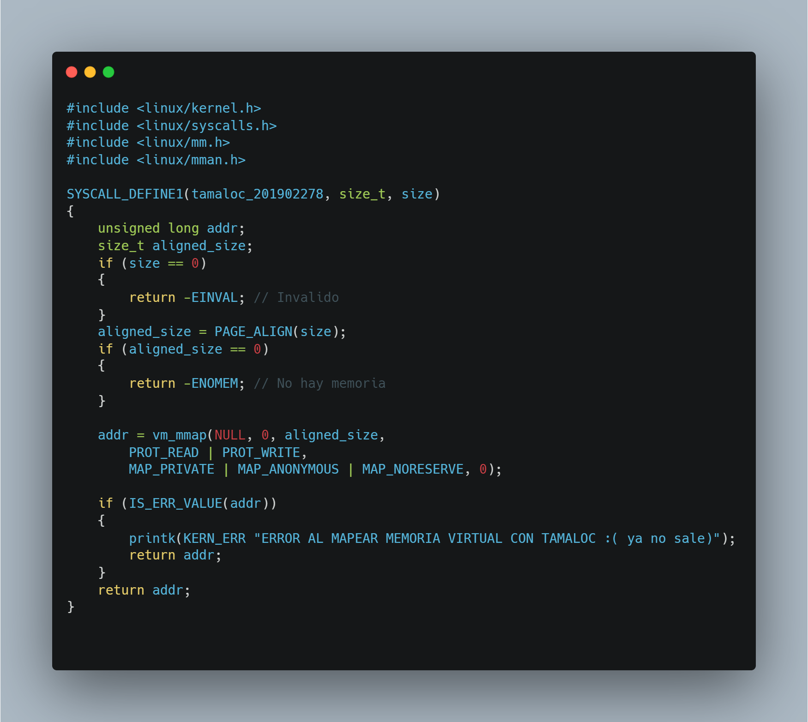
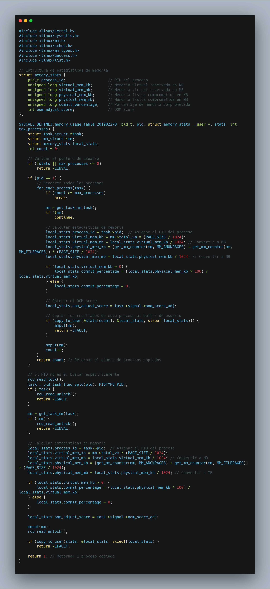
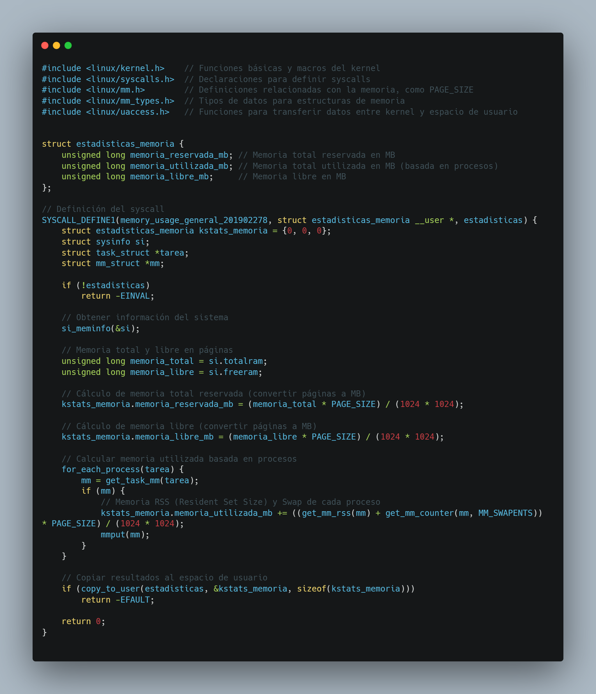
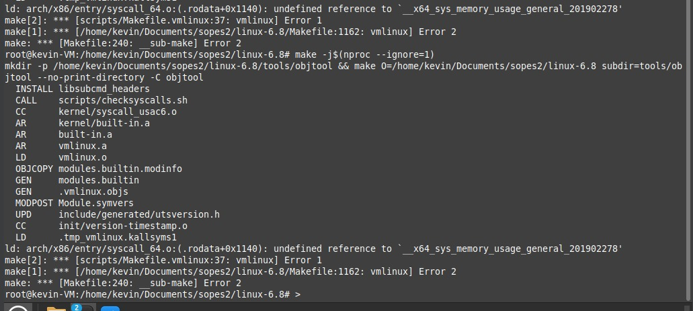
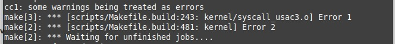
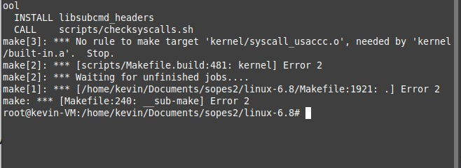

# _Manual Técnico ☝️🤓_

## 📚 Contenido

- 🎯 Objetivos
- 📍 Tecnologías
- 🛠️ Herramientas
- 💼 Paquetes
- 🛡️ Guía Instalación
- Informe Técnico ☢️
- Detalles de las syscalls y modulo de Kernel 🕵️
- Pruebas Realizadas 🩻
- 🤔 Reflexión Personal y autoevaluación
## 🎯 Objetivos

## General

Modificar el Kernel de linux en la versión 6.8.49 para poder desarollar e integrar un sistema eficiente para llevar a cabo la gestión de memoría en el kernel de Linux que permita la inicialización de memoria en cero mediante técnicas de asignación usando lazy-zeroing, optimizando el uso de recurso físicos y mejorando el manejo de las estádisticas en tiempo real

## Específicos

- Implementar una syscall para recolección de memoria.
- Diseñar un algoritmo de asignación basado en lazy-zeroing llamado tamaloc.

## 📍 Tecnologías

Estas son las tecnologías, herramientas y paquetes utilizados en el proyecto:

- [**Kernel linux mint versión 6.8.0**](https://www.kernel.org/pub/linux/kernel/v6.x/linux-6.8.tar.xz)
- [**Gitkraken**](https://www.gitkraken.com/)
## 🛠️ Herramientas

- [**Oracle VM VirtualBox Administrator:**](https://www.virtualbox.org/wiki/Downloads)
- [**Visual Studio Code:**](https://code.visualstudio.com/download)

## 💼 Paquetes
- GCC
- MAKE
- libncurses-dev
- libncurses5-dev
## 🛡️ Guía Instalación
Ejecutar los siguientes comandos para instalar las herramientas y librerías.
```bash
sudo apt-get install build-essential libncurses5-dev fakeroot wget bzip2 openssl
sudo apt-get install build-essential libncurses-dev bison flex libssl-dev libelf-dev
```
## Copiar configuración del kernel en uso:

```bash
cp -v /boot/config-$(uname -r) .config
```
## Desactivación de Llaves de Confianza

Ejecuta los siguientes comandos para desactivar las llaves de confianza del sistema:

```bash
scripts/config --disable SYSTEM_TRUSTED_KEYS
scripts/config --disable SYSTEM_REVOCATION_KEYS
```
### Explicación

- **SYSTEM_TRUSTED_KEYS**: Llaves usadas para verificar módulos firmados.
- **SYSTEM_REVOCATION_KEYS**: Llaves revocadas del sistema.

Estos comandos ajustan la configuración para deshabilitar estas características.

## Cambio de la Variable EXTRAVERSION

Para cambiar el valor de **EXTRAVERSION** en el archivo de configuración del kernel, sigue estos pasos:

1. Abre el archivo `Makefile` en el directorio raíz del código fuente del kernel:

   ```bash
   nano Makefile
   ```

2. Busca la línea que contiene **EXTRAVERSION**:

   ```Makefile
   EXTRAVERSION = -49-usac1
   ```

3. Cambia el valor de **EXTRAVERSION** según tus necesidades. Por ejemplo:

   ```Makefile
   EXTRAVERSION = -custom1
   ```

4. Guarda los cambios y cierra el editor.

   - En `nano`, presiona `CTRL+O` para guardar y `CTRL+X` para salir.
5. Verifica los cambios ejecutando:

   ```bash
   uname -r
   ```
### Nota 📝
El valor de **EXTRAVERSION** se agrega al número de versión del kernel para identificar compilaciones personalizadas.

## Recompilación del Kernel

Para recompilar el kernel, sigue los pasos a continuación:

1. Cambia al usuario root:

   ```bash
   sudo -s
   ```

2. Ve al directorio del código fuente del kernel:

   ```bash
   cd Linux/6.8
   ```

3. Limpia los archivos de compilaciones anteriores:

   ```bash
   make clean
   ```

4. Carga la configuración actual del kernel:

   ```bash
   make oldconfig
   ```

5. Opcional: Ajusta la configuración del kernel usando una interfaz de menú:

   ```bash
   make menuconfig
   ```

6. Genera una configuración basada en los módulos cargados actualmente:

   ```bash
   make localmodconfig
   ```

7. Compila el kernel utilizando todos los núcleos menos uno para optimizar:

   ```bash
   make -j$(nproc --ignore=1)
   ```

## Crear un Enlace Simbólico

Ejecuta el siguiente comando para crear un enlace simbólico:

```bash
ln -s /home/kevin/Documents/So2_201902278_VD2024/arch/x86/entry/syscalls/syscall_64.tbl syscall_64.tbl
```


### Explicación del Comando

- **ln**: Comando para crear enlaces (duros o simbólicos).
- **-s**: Especifica que el enlace debe ser simbólico (soft link).
- `/home/kevin/Documents/So2_201902278_VD2024/arch/x86/entry/syscalls/syscall_64.tbl`: Ruta absoluta del archivo original.
- `syscall_64.tbl`: Nombre del enlace simbólico que se creará en el directorio actual.

### Resultado

Después de ejecutar el comando:
- Se crea un archivo simbólico llamado `syscall_64.tbl` en el directorio actual.
- Este enlace apunta al archivo original en `/home/kevin/Documents/So2_201902278_VD2024/arch/x86/entry/syscalls/syscall_64.tbl`.

Luego de crear los enlaces simbolicos comenzamos con la elaboración de los modulos de kernel, para eso debemos de modificar/crear los siguientes archivos 

# Modificaciones en módulo de Kernel 
obj-y += syscall_usac.o 
## Makefile
- se modificó <u>**obj-m += syscall_usac.o**</u> en un **Makefile** para la construcción de un kernel de linux.

se modificó **obj-m += syscall_usac.o**

## syscall_usac.c 📞
En el archivo de **syscall_usac.c** se implementan las 3 llamadas al sistema (syscalls), estas son: 
- capture_memory_snapshot_201902278
- track_syscall_usage_201902278.
- get_io_throttle_201902278.
## syscall_64.tbl
En la syscall.tbl se asigna el número de syscall a llamar las syscall del proyecto.
## Informe Técnico

 ## tamalloc


## memory_usage_table.


##  memory_usage_general.


## Detalles de las syscalls y modulo de Kernel 🕵️
## Pruebas Realizadas 🩻/ Errores




## 🤔 Reflexión Personal y autoevaluación
Durante el desarollo del Proyecto 2, uno de los mayores desafíos fue el calculo correcto del OOM Score de cada proceso. Debido a que este puntaje, utlizado por el kernel de linux para priorizar qué procesos debe eliminar en situaciones de memoria insuficiente, requiere un análisis detallados de múltiples factores, incluidos el consumo de meoria, las prioridades del proceso y las políticas del sistema.

### Logros y Aspectos Positivos:

- Consolidación de conocimientos técnicos.
- Enfoque estructurado y metodólogico.
- Generar un mayor interes en el uso de Linux.

### Lecciones Aprendidas:

- Importancia de la planificación.
- Documentación y Depuración.
- Manejo de Complejidad.
- Comunicación entre Kernel y espacio de Usuario.